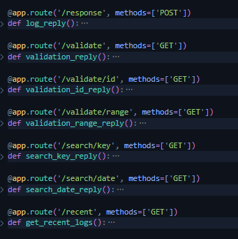

# Audit System

This systems allow the components of the datatrust to save the activity registry that is needed to keep in time (what we usually call 'logs').

In this case (and as a general definition), a log is an object that stores the metadata of an action, that was made in the system. When the admin creates a policy, a log stores the information of when, who, and what did he do. This is just one case, of many. It is desirable that ALL the actions that were made, have a register, a log, to persist.

All the logs are stored in a file. There is a server, in charge of manage all of the tasks related with the store, search, validation and query of each of logs. This is how it works in this implementation:

## Log structure

In our datatrust, a log contains the following information:

`{
    "log_id": 1,
    "timestamp": 1717956722.532317,
    "source": "user_1",
    "destination": "rds_db_1",
    "type": "query",
    "description": {
        "content": {
            "database": "db_identifier",
            "query": "SELECT * FROM TABLE personas"
        }
    },
    "last_hash": "3683b51926e1976efd40f3d67356859d016a4a057ae7bc631be551ff7ab410a4",
    "actual_hash": "3ad13d39b47d08432062f98e4a42d6512de44f21f6969e4a6b3431cdf511292e"
}`

Where:
- *log_id* is an unique identificator of the log
- *timestamp* is the time where the log was registered, in *epoch*
- *source* is the identity that made the action
- *type* is the type of action. It is useful for search methods
- *description* is the action information itself represented as a dict. It depends on the *type* of log.
- *last_hash* is a reference of the previous log.
- *actual_hash* is the hash of the log that is being read.

Both *last_hash* and *actual_hash* are used for security and validation processes (which are going to be explained later).

## Server description

The server in charge of manage all content related to logs, is in this case, a web server in python - FLASK, where all of the functions are invoked using HTTP methods.

For searching tasks, the server uses Pandas.

To ensure that only allowed services are consuming the services, there is a Validation process based on tokens. The sender and the log server must calculate a hash. This hash is the result of a combination of values that ONLY sender and server know. This hash is sent as the token, in the HTTP header `Authorization`. An valid token will return a 201 state, otherwise, state 400 is returned.

The server is listening port 5000.

The logs will persist in a file called `audit.txt`.

## Server Functions

The following is a list of functions that the server allows:

- **/response**: A POST method. The log structure is required to be sent in the request. This function registers the log that is recieved. Returns wether the log could be registered or not.

- **/validate**: A GET method. No structure required. It will read the log file (audit.txt) and, for each log, is going to calculate the hash. If there is no inconsistency,  returns an OK. If there is a consistency error, it will return the `log_id` of the log that presented the error.

- **/validate/id**: A GET method. _log_id_ required. It will only calculate the hash of the log that has the recieved _log_id_.

- **/validate/range**: A GET method. a start and end id required. It will calculate the hash of the logs which have _log_id_ between start and end id.

- **/search/key**: A GET method. key and value required. It will return the logs that matches the key-value data. The "key" data must be one of the log keys (type, source, destination...)

- **/search/date**: A GET method. Initial and final date required. It will return the logs that were registered between the dates recieved in the request. The dates must follow this format YYYY-MM-DD

- **/recent**: A GET method. An int `count` required. It will return the last logs registered by the time the request is recieved. The count of logs to return is defined by the `count` value sent in the request.

There is a python script called `calls.py`. It has the scripts that triggers the functions described before. It also generates the valid token and have some examples of usage. The only requirement (apart from basic python tools) is the `requests`library.