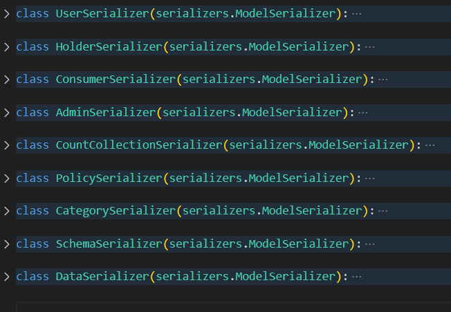

# Backend System

This system acts as a bridge between the user interface (frontend) and the data storage (database). Likewise, some actions performed from the frontend are reflected in the audit log through the backend. The relevant Backend functions being the following:

* Intermediate layer that processes frontend requests and translates them into operations on the database.
* Performs business logic, such as data validation, calculations, and access to other systems.
* Orchestrates communication between the frontend and the database, ensuring data integrity.
* Sends information about the actions taken to the audit system.

## Typical workflow:

1. **The user interacts with the frontend:** Perform an action, such as creating a new record, editing existing data, or deleting a record.
2. **The frontend sends a request to the backend:** The request contains the data necessary to perform the operation.
3. **The backend processes the request:**
* Validate the request data.
* Performs necessary operations on the database (insert, update, delete).
* Generates an audit log with details of the action performed, the user who performed it, and the date and time.
4. **The audit system records the action:** The audit log is stored in a log file.
5. **The backend sends a response to the frontend:** The response indicates whether the operation was successful and may include additional information, such as a confirmation message or an error.
6. **The frontend updates the interface:** Show the results of the operation to the user.

## Benefits of this approach:

1. **Greater security:** The audit system provides a detailed record of all actions taken, making it easy to detect fraud and errors.
2. **Better traceability:** History of data changes can be easily tracked.
3. **Regulatory compliance:** Helps meet legal and compliance requirements that require auditing of system actions.
4. **Ease of maintenance:** The separation of responsibilities between the frontend, backend and database facilitates the development, maintenance and scaling of the system.

## Implementation example:

1. **Frontend:** Django with a REST API to communicate with the backend.
2. **Backend:** Django with an ORM framework to interact with the database.
3. **Database:** MongoDB to store system data.
4. **Audit system:** A standalone Python-based application that allows you to record actions.

## Server description

The server in charge of managing everything related to the backend is, in this case, a Django server whose functions are invoked through http requests and which are listening through port 8000.

The workflow when making an http request to an endpoint consists of the following:

1. **HTTP request:** A client (browser, other application) sends an HTTP request (GET, POST, PUT, DELETE, etc.) to a specific endpoint of our Django application.
2. **URLconf:** Django looks in your URLconf (URL configuration) to find the URL that matches the incoming request. Once found, the request is assigned to the corresponding view.
3. **View:** The view is a Python function that receives the HTTP request as input.
* **Extracts** data: The view extracts the necessary data from the request, such as URL parameters, data from the request body (in the case of POST, PUT, etc.), or data from cookies or sessions.
* **Performs business logic:** The view can perform any type of business logic, such as:
** Validate the data received.
** Interact with the database through models.
** Perform calculations or data transformations.
** Generate personalized responses.
* **Calls other components:** The view can call other components such as services, helpers or templates.
4. **Models:** If the view needs to access or modify data in the database, it interacts with the models. Models represent database tables and allow CRUD (Create, Read, Update, Delete) operations.
5. **Serializers:** Serializers are used to convert Python objects (such as model instances) into data formats that can be sent in HTTP responses (for example, JSON). They are also used to validate the data received in the requests.
6. **Permissions:** Permissions control which users can access which parts of the application. Django has a built-in permissions system that allows you to define permissions at the model level and at the view level.
7. **HTTP Response:** Finally, the view returns an HTTP response to the client. This response may contain rendered HTML, JSON data, a redirect, or an error.

## Models

1. **CustomerUser:** Model which defines the parameters that user has, regardless of the role assigned.
2. **Holder:** Model which defines the parameters that will have a user who registers with the owner role
3. **Consumer:** Model which defines the parameters that will have a user who registers with a consumer role
4. **Admin:** Model which defines the parameters that will have a user who registers with a admin role
5. **Category:** Model which defines the parameters that will have a category created by an administrator
6. **Policy:** Model which defines the parameters that will have a policy created by an administrator
7. **Schema:** Model which defines the parameters that will have a schema created by an administrator
8. **Data:** Model which defines the parameters that will have a data stored by an owner user
9. **CountCollection:** Model which defines the parameters that will have the collection id count of the other collections.

## Serializers

Each of the serializers contains the pointer to the model attributes it indicates. That is, if the serializer is from the owner, this
It's going to point to the attributes of that model.

## Permissions

The decorators will restrict each function of the views to users with the specified role, this is detected through the token they send when calling the backend endpoint.

## Server Functions

### Functions

1. **verifyDate:** function in charge of verifying those policies that have met their expiration date in order to eliminate it, and subsequently, eliminate it from the consumer authorizations and also eliminate the data uploaded by the owners who have registered that policy.
2. **saveData:** It is responsible for storing in the file system of the Backend container, in the path /holder/{idHolder}/schema/{filename} the file that the owner uploaded, and also uploading the corresponding information of that file to the data collection. . Verify that the file to be uploaded corresponds to the scheme indicated.
3. **updateData:** It is responsible for updating an already uploaded file, verifying that the data such as file headers agree with the specified schema.
4. **deleteData:** It is responsible for deleting the information regarding a file from the data collection, then deleting the stored file.
5. **downloadDataHolder:** It is responsible for searching for the indicated file and downloading it to be able to update it.
6. **sign:** This function is called when a consumer accepts the contract and wants to create a conglomerate set of data, forming a dataset. This function creates a new authorization that is indicated in the authorizations field of the consumer and the owner as the consumer who has their information so that owners and consumers have transparency of their actions.
7. **downloadSchema:** It is responsible for analyzing the structure of the specified schema and creates a new file with the structure template and subsequently downloads the file so that the user can fill it with information.
8. **downloadEncrypted:** Called when a consumer wants to download their signed dataset to manipulate them, this downloads the fully encrypted conglomerate information in the fields that were specified at the time of assigning the schema to the dataset.

### Class

Each class has the respective CRUD operations for the collection they point to.

## Endpoints

The follow endpoints call the specific class of a model:
* registers, category, holders, consumers, admin, policy, data, schema, count
-------------------------------------------------------------------------------------------------------------------------

The follow endpoints call the specific function that their name said (except "api/"):

* **updateData/<str:idData>/:** Call the function updateData and recieve one parameter, the Data id that will update
* **deleteData/<str:idData>/:** Call the function deleteData and recieve one parameter, the Data id that will delete
* **downloadSchema/<str:idSchema>/:** Call the function downloadSchema and recieve one parameter, the schema id that will download
* **saveData/<str:userType>/<str:idUser>/:** Call the function saveData and recieve two parameters, the userType which is saving the data and their id
* **downloadDataHolder/<str:idHolder>/<str:idSchema>/:** Call the function downloadDataHolder and recieve two parameters, the holder id that need their data and the schema id which the data belong.
* **downloadEncrypted/<str:idConsumer>/<str:idSchema>/<str:carpet>/:** Call the function downloadEncrypted and recieve three parameters, the consumer id which the data belong, the schema id which was created the data and the carpet is an String with the date when was created the encrypted data (this field is specified in the information of the consumer document in the database)
* **login/:** Call the function login, which validated body request with the credentials and return token access in case of correct credentials specified. The body recieve username:str and password:str fields.
* **sign/:** Call the function sign, and recieve in body request. The body recieve idConsumer:str, lstDataId:strList, and idSchema:str.
* **verifyDate/:** Call the function verifyDate.
* **api/:** all the endpoint may be call specifying :8000/api/{enpoint}

## Before implementation

Take a look to de file settings located in *src/project/project/settings.py*. verify that the ip of your server is allowed in the field "allowed_hosts" and if the app is for production the DEBUG field may be in False. 
In the file Settings.py you can configure the execution of the Django backend app.

## Populate database

For populate the database with dummies data you should execute the follow steps:
* **Have already installed Python and pip**
* **Install the libraries:** requests, datetime, pandas openpyxl; **command:** *pip install requests datetime pandas openpyxl*
* **Execute file**: execute with Python the file called populate_data.py located in the folder scripts inside the folder handsonDataTrust, this file may be executed with an int parameter that specified the number of users that the database will store; **comand example:** *python populate_data.py 10*

